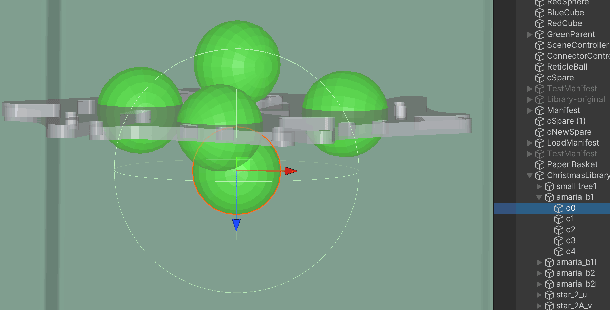
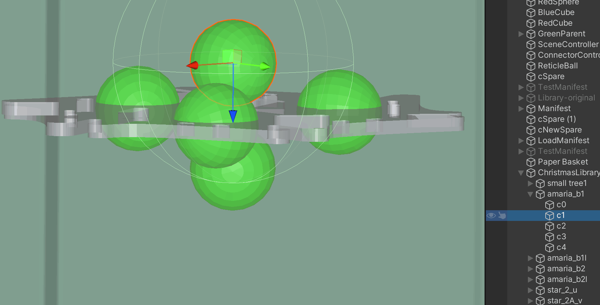
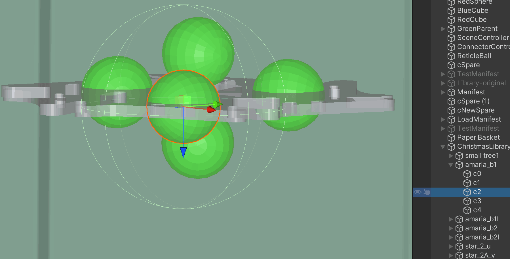
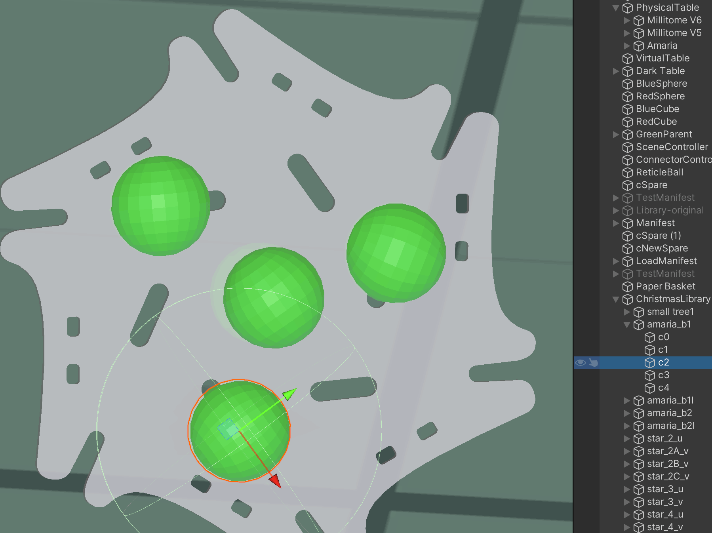
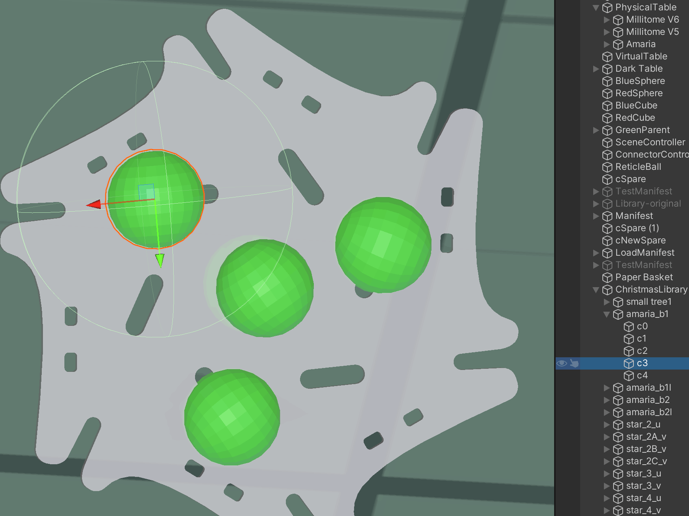
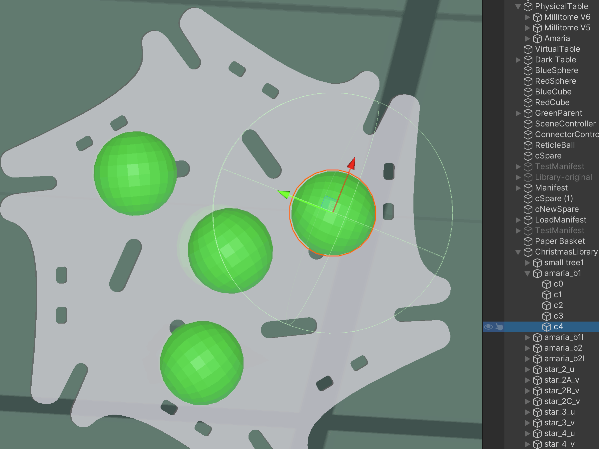
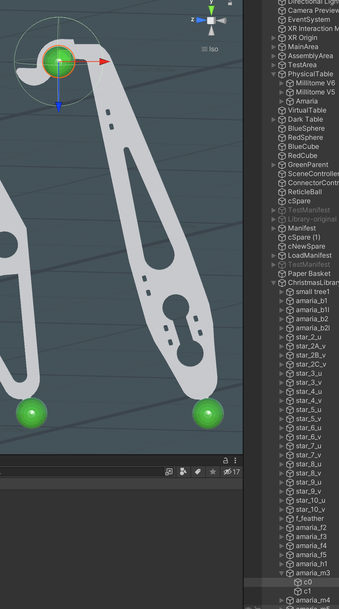
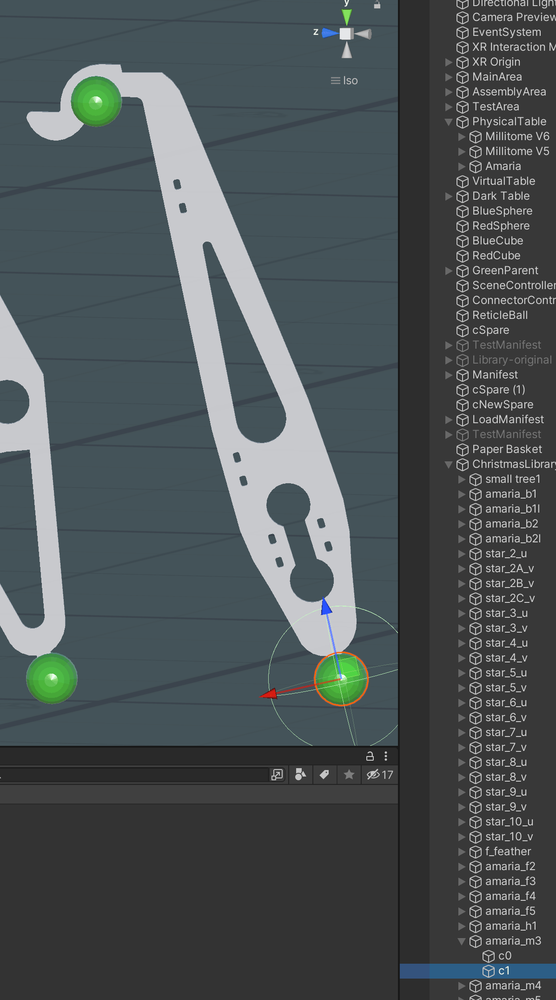
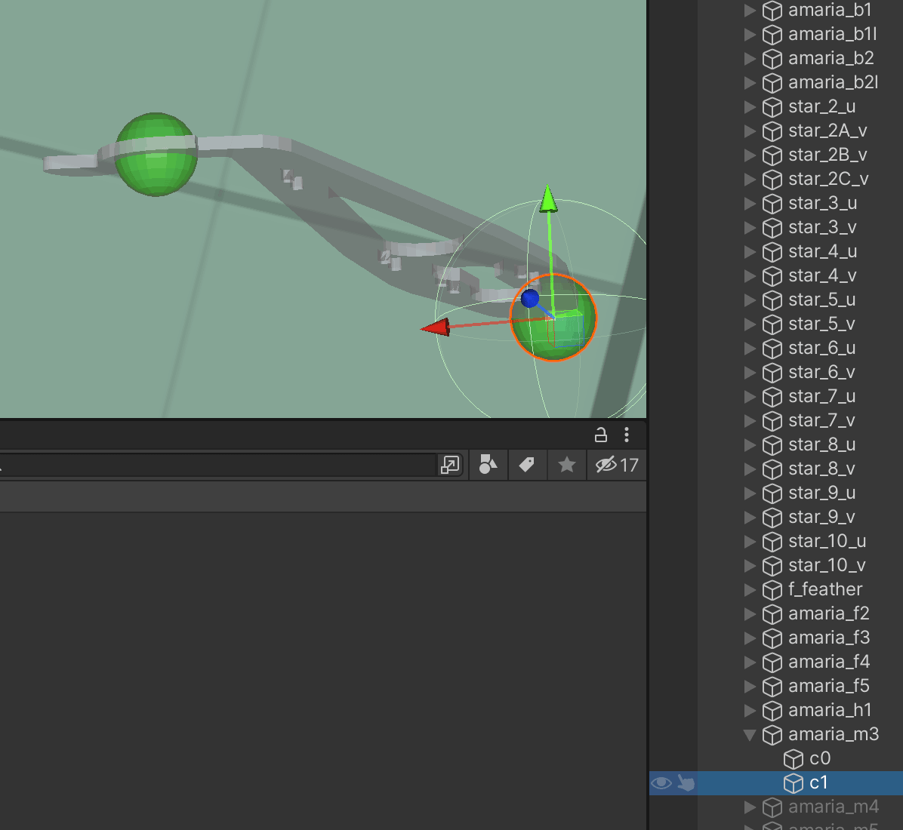
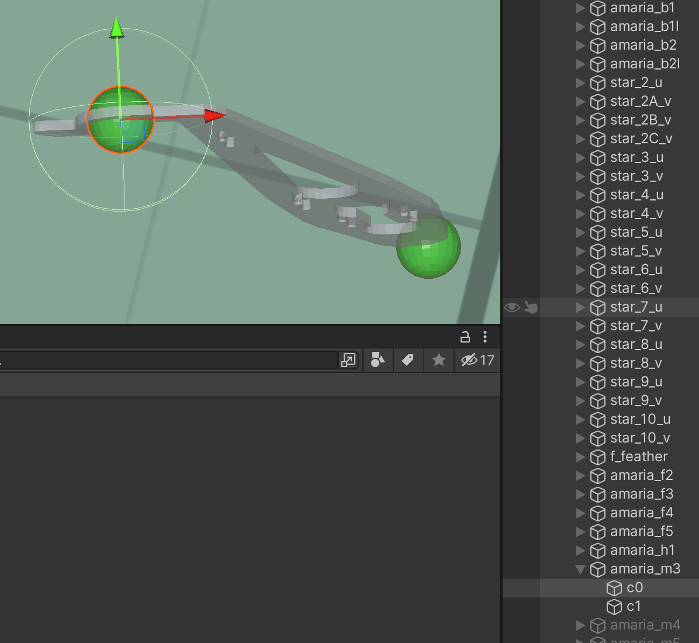

# Node Orientation and Alignment

## Amaria base plates

  

  Fig.1 side view; c0 node blue points down

  

  Fig.2 side view; c1 node blue points down

  

  Fig.3 side view; c2 node blue points down

  

  Fig.4 top view; c2 orientation of red/green arrows will align with same arrows on connected part

  

  Fig.5 top view; c3 orientation of red/green arrows will align with same arrows on connected part

  

  Fig.6 top view; c4 orientation of red/green arrows will align with same arrows on connected part

## Amaria motor mounts

Matching counter parts for Amaria base plates.

  

  Fig.7 side view; c0 node

  

  Fig.8 side view; c1 used as hanger, attached items will point down

  

  Fig.9 top view; red/green arrow determine "twist" of attached item

  

  Fig.10 top view; red arrow pointing "away" from assembly

