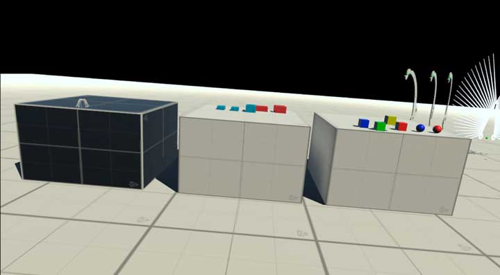
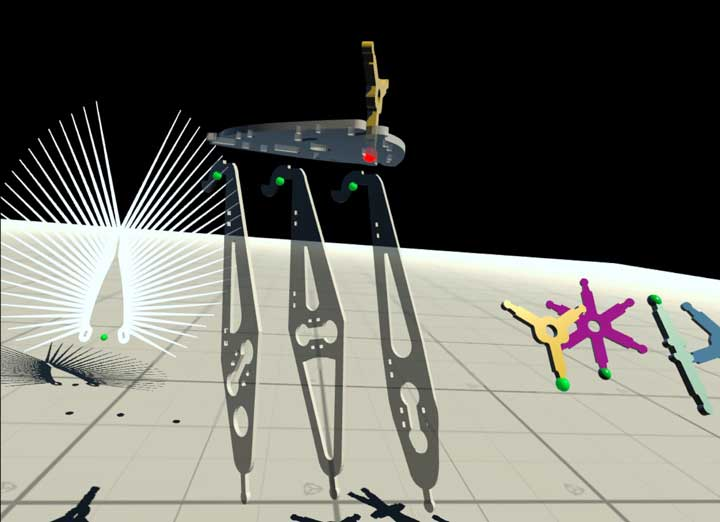
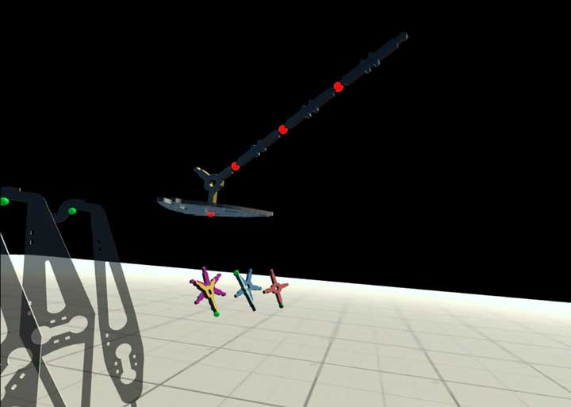

# 4025C_VR
(current version 0.1.12, 2022-12-11)

  

## Operating and Interaction Instructions
---

### Right controller functions

Right controller actions interact with the VR room and the objects inside it. The thick blue ray from the right controller is used to teleport:
- Instantly jump to the position on the ground the ray is pointed at
- Instantly jump to work areas by aiming the ray at transport spheres hovering above your head
- Interact with the small, colored control nodes on some objects. If the blue ray is pointed at a "solid" object, it will change its color to red.

**Grab Button** (teleport)  - if the ray is pointed at the floor or a transport sphere, a teleportation is initiated, the ray stays blue, user is moved to requested position.

**Grab Button** (select) - select the spherical node object the ray is pointed at; the actual results depend on previous actions (see below).

**Grab Button** (grab) - the three tables in the Main Area show various objects that can be picked up, dropped, thrown, etc. 

  

  

  

**Menu Button** - application control menu; quit, start video recording or take pictures; provided by the operating system.

**Thumbstick** - left/right rotates the viewer in 45 degree increments to the left/right.

---

### Left controller functions

Left controller actions interact with the console window, as does the left ray. At the moment this is used for debugging.

  

**Menu Button** - show/hide console.

**Trigger Button** - "press" the virtual buttons in the Console (Clear, System/Nodes).

**Thumbstick** - forward/backward; adjust console window distance from viewer.

--- 

## Work Planes

In this version there are three planes the user can teleport to. This is done by triggering one of the teleport spheres. These spheres hang over the user's head, slightly to the left and can't be seen unless you look up. 

  

Three areas can be visited:

### Main Area

Here the user interacts with objects at their natural size. Objects on the three tables can be picked up, thrown, dropped.

### Assembly Area

The assembly area contains individual components, sized to 10x their natural size. These components can be assembled into complex larger structures by connecting the green nodes on various components. 

  

The assembly process in detail:
After entering the area, select and click any of the green nodes. The clicked node will turn yellow to show it is selected and is waiting for the user to select another node to connect to. Any possible connector locations will be shown in green. The first connection, though, is to the green base node, floating approximately in the middle of all the objects. Clicking on it will move a copy of the first object and connect it to the base node. After successful connection all potential source nodes become clickable again. In a growing assembly, nodes where two objects are connected are shwon in red. Clicking on a red connector in an assembly will remove and delete any components attached to that node.

The green base node.

  

After assembly is finished, the user can teleport back to the main area by clicking the appropriate transport node (above your head, slightly to the left). The assembled structure will be packaged and transported back to one of the work tables in the main area. It will be reduced to its natural size and transformed into a single object that can be picked up. 

### Area 51

While the user can teleport from and to this area using the teleoprt nodes there is nothing to see or do. It is an experimental plane (as the name implies).

### Specifics about the sphere node connectors

This version of the app has a 14 "connectable" pieces (components from various IoT projects - all blown up to 10x their regular size).
These components have varying numbers of connector nodes on them. When the app launches, the user sees green nodes on some of the objects. Any of these nodes can be clicked. 

  

The clicked node will turn yellow to show that it is now waiting for the user to select a second node to connect it to. At that stage only eligible destination nodes are shown. Click any of them. 

  

The object is now moved so that both nodes are at the same location in the scene. This concludes a successful connection, the connected node turns red.

  

You will notice that rather than moving the original object to its destination, the app made a clone. Every successful connection clones the originator object. Infinite supply.

Connections between two objects have a red connector. Clicking on a red connector will dissolve the connection and delete all connected objects on this particular branch.

  

