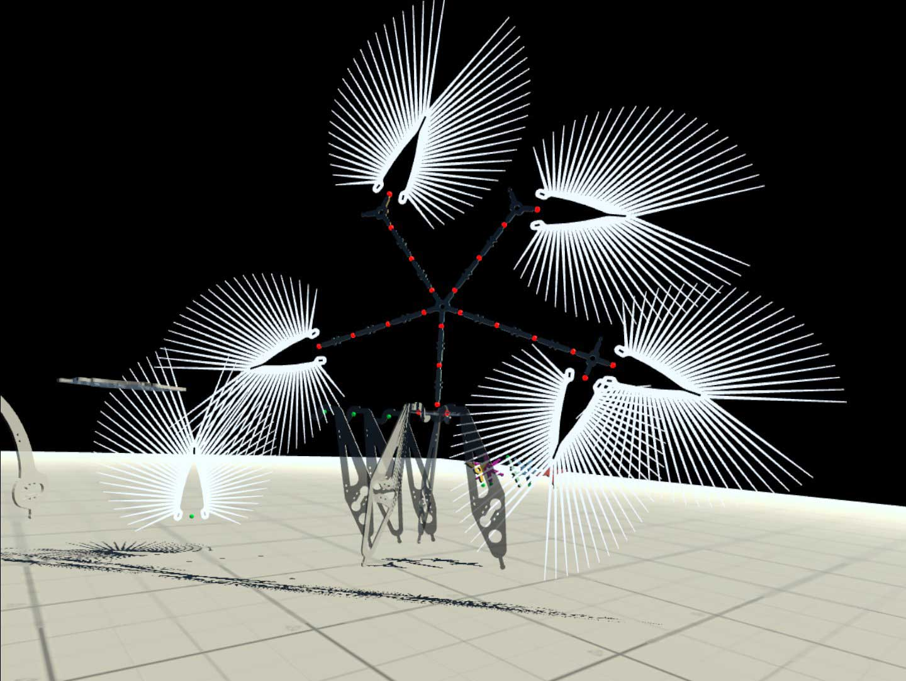

# 4025C_VR
(current version 0.1.12, 2022-12-11)

  

# Table of Contents
- Quick Start
- Overview and Purpose
- Work Areas
  - Main Area
  - Assembly Area
  - Area 51
- Details??
---
# Quick Start

After launching the app you are placed in the Main Area facing three work tables.

IMAGE

All interactions with items in the workspace are controlled by the grip button on the right handset. You point the blue ray at things. When a solid object is encountered, the ray turns red. Push the grip button to perform an "action". What action is performed depends on the object:
- floor
- objects

## Overview and Purpose
---

4025C_VR is a VR application for the Oculus Quest 2 headset. It was conceived to allow experimenting with a growing number of IoT components and elements in a virtual environment. 

The current version lets the user interact in three different work areas.

## Main Area
IMAGE

Here the user can interact with objects and object assemblies at a realistic size, i.e. objects such as tables, paper basket, model assemblies, etc. appear to the user as they would in reality. Objects can be picked up, dropped, stacked unto each other, thrown in the trash. Assemblies created in the application are automatically saved when the app is quit and re-loaded and placed at their last locations in the scene. After launching the app, the user is put into the Main Area by the three tables.

## Assembly Area
IMAGES 

The Assembly Area can be reached by clicking on the respective transport sphere (look up to see them). The user is then teleported to the center of the Assembly Area next to a so-called library, or component collection. The current collection contains ~30 components plus a toy christmas tree for the Christmas edition. One significant feature of the Assembly Area is that the componments are literally "larger-than-life". The Christmas edition uses components of 3x their natural size. This makes it easier to interact with the objects.

A white circle on the floor marks the actual build position. After the user pops into this area, every component will show a single green sphere. This is a connector node. Anyone of these nodes can be clicked, which will turn that node yellow and show a larger blue node over the build position. The yellow node tells the user that it is now selected and is waiting to be connected to another node. Only eligible connection targets are visible. A click on the large blue node makes a copy of the component and connects (i.e. moves) it to the blue build node. At this point we have a successful connection, which is shown by a red node between the connected parts. Now another component can be picked, again by clicking its single node followed by an open node on the assembly.

A red connection node can be clicked to remove (delete) any components from that node on to the end of that chain.

To find the green nodes on the christmas tree you may have to walk around the tree (or do short on-site teleports). It is possible to teleport while in connection mode (yellow node).

The user can return to the Main Area at any point by clicking the respective transport sphere. If there is an assembly on the build node it will travel with the user to the Main Area and appear on the black table on the left; it will materialize in it's natural size, can be picked up, dropped, thrown. At this point it is not editable. 

Repeated trips to the Assembly Area with successful assemblies will eventually fill the black table. Fresh assemblies will materialize in the center of the black table and potentially bump objects already there off the table.

## Area 51
IMAGE

This area can be visited, but at the moment there is nothing there. I use it as an experimental area.

## Operating and Interaction Instructions
---

### Right controller functions

Right controller actions interact with the VR room and the objects inside it. The thick blue ray from the right controller is used to teleport:
- Instantly jump to the position on the ground the ray is pointed at
- Instantly jump to work areas by aiming the ray at transport spheres hovering above your head
- Interact with the small, colored control nodes on some objects. If the blue ray is pointed at a "solid" object, it will change its color to red.

**Grab Button** (teleport)  - if the ray is pointed at the floor or a transport sphere, a teleportation is initiated, the ray stays blue, user is moved to requested position.

**Grab Button** (select) - select the spherical node object the ray is pointed at; the actual results depend on previous actions (see below).

**Grab Button** (grab) - the three tables in the Main Area show various objects that can be picked up, dropped, thrown, etc. 

  

  

  

**Menu Button** - application control menu; quit, start video recording or take pictures; provided by the operating system.

**Thumbstick** - left/right rotates the viewer in 45 degree increments to the left/right.

---

### Left controller functions

Left controller actions interact with the console window, as does the left ray. At the moment this is used for debugging.

  

**Menu Button** - show/hide console.

**Trigger Button** - "press" the virtual buttons in the Console (Clear, System/Nodes).

**Thumbstick** - forward/backward; adjust console window distance from viewer.

--- 

## Work Planes

In this version there are three planes the user can teleport to. This is done by triggering one of the teleport spheres. These spheres hang over the user's head, slightly to the left and can't be seen unless you look up. 

  

Three areas can be visited:

### Main Area

Here the user interacts with objects at their natural size. Objects on the three tables can be picked up, thrown, dropped.

### Assembly Area

The assembly area contains individual components, sized to 10x their natural size. These components can be assembled into complex larger structures by connecting the green nodes on various components. 

  

The assembly process in detail:
After entering the area, select and click any of the green nodes. The clicked node will turn yellow to show it is selected and is waiting for the user to select another node to connect to. Any possible connector locations will be shown in green. The first connection, though, is to the green base node, floating approximately in the middle of all the objects. Clicking on it will move a copy of the first object and connect it to the base node. After successful connection all potential source nodes become clickable again. In a growing assembly, nodes where two objects are connected are shwon in red. Clicking on a red connector in an assembly will remove and delete any components attached to that node.

The green base node.

  

After assembly is finished, the user can teleport back to the main area by clicking the appropriate transport node (above your head, slightly to the left). The assembled structure will be packaged and transported back to one of the work tables in the main area. It will be reduced to its natural size and transformed into a single object that can be picked up. 

### Area 51

While the user can teleport from and to this area using the teleoprt nodes there is nothing to see or do. It is an experimental plane (as the name implies).

### Specifics about the sphere node connectors

This version of the app has a 14 "connectable" pieces (components from various IoT projects - all blown up to 10x their regular size).
These components have varying numbers of connector nodes on them. When the app launches, the user sees green nodes on some of the objects. Any of these nodes can be clicked. 

  

The clicked node will turn yellow to show that it is now waiting for the user to select a second node to connect it to. At that stage only eligible destination nodes are shown. Click any of them. 

  

The object is now moved so that both nodes are at the same location in the scene. This concludes a successful connection, the connected node turns red.

  

You will notice that rather than moving the original object to its destination, the app made a clone. Every successful connection clones the originator object. Infinite supply.

Connections between two objects have a red connector. Clicking on a red connector will dissolve the connection and delete all connected objects on this particular branch.

  

