# Exporting STL files from AutoCad

## Introduction

[AutoCAD](https://www.autodesk.com/products/autocad/overview?term=1-YEAR&tab=subscription) is used to create precise 2D drawings. It is my go-to application to create 2D geometry for laser cutting. 

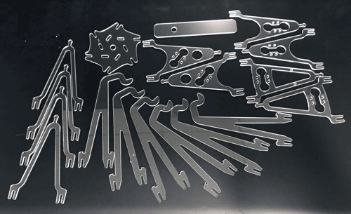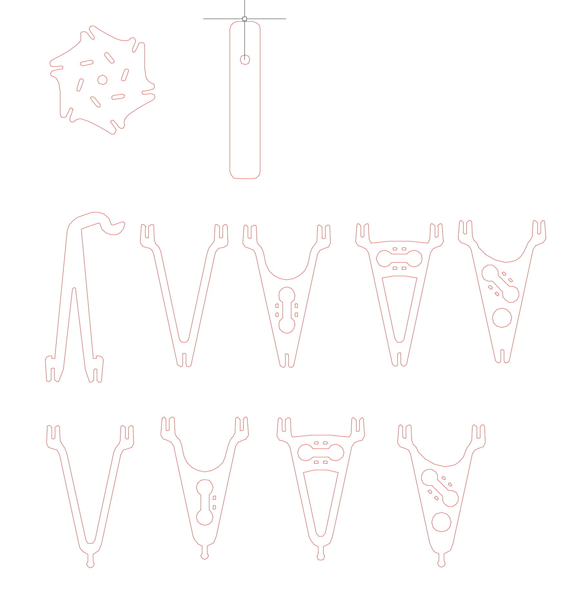

  Fig.1 Laser-cut acrylic parts (left), same set of parts in AutoCAD (right)

AutoCAD can also be utilized to produce complex and precise 3D drawings for architecture and engineering. For many of my own projects I need to create 3D assets from existing 2D drawings. One particular purpose are 3D visualizations of IoT projects, before any laser cut is made. 

  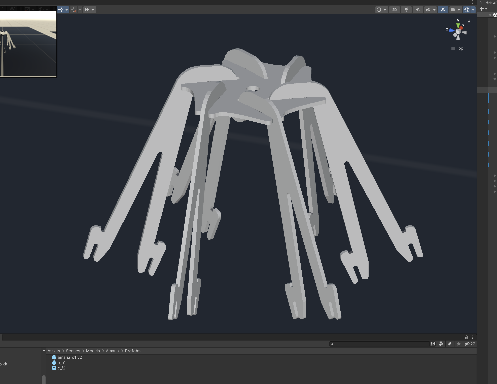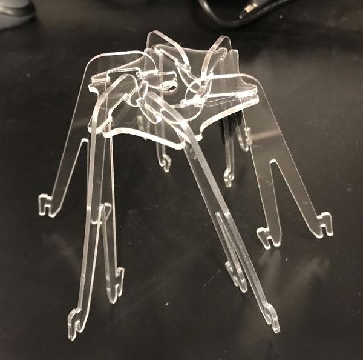

  Fig.2 Partial assembly visualization (left), physical assembly (right)

In this case the 2D line drawing of a specific object in AutoCAD has to be transformed into a 3D object. This sounds like a relatively straight forward procedure; in a dedicated 3D application, such as Blender, one would use an *extrude* function to add "thickness" to a surface. Of course AutoCAD also has an *extrude* command and applied to a <strong>properly</strong> constructed 2D object it will yield useable results.

  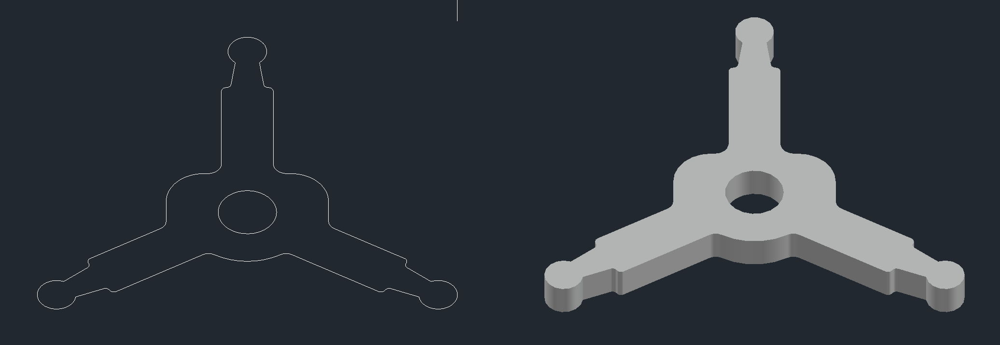

  Fig.3 2D object (left), successfully extruded into 3D (right)

The process sounds logical and straight-forward, but I found shapes often do not extrude properly or not at all. This has been a problem with AutoCAD files I received from another source. Upon "exploding" (unjoining) shapes they are often composed of subsections of many different types (*polylines*, *splines*, *arcs*, etc). Sometimes I have been able to find the single offending primitive and replace it with a *polyline*, enabling successful extrusion. Often it is quicker to draw a new *polyline* using the existing shape as a template - this is a relatively quick process with a AutoCAD's snap settings.

## Rebuilding a shape using *polyline* (*pline*)

### Isolate individual connected parts and check for extrusion

  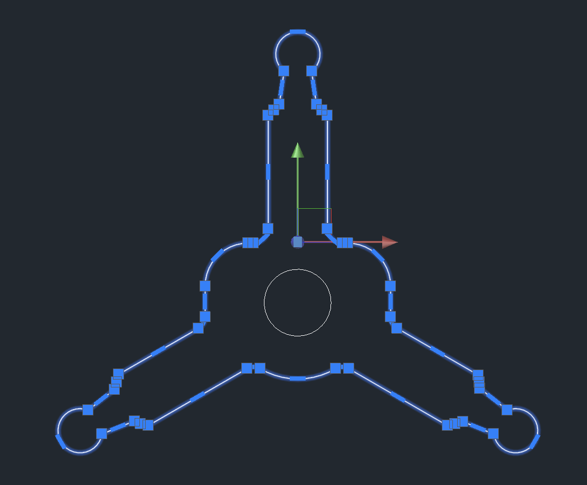

  Fig.4 The example shape is a 3-pronged star with a round hole at the center. If the star shape and the circle in the center are grouped/joined use *ungroup* or *explode* to dissolve.

In our case we can verify that the center circle extrudes correctly. Not so the star shape.

### Use layers to set up template

Make a copy of your complete shape before continuing, and paste it somewhere in your workspace. I often find it easier to use a copy of my object rather than depending on AutoCAD's undo function, in case something goes wrong.

Assign the shape you intend to use as a template (here, the star shape) to another layer - my template layer uses the color white to draw the shape. Assign the circle shape to another layer, which you can make invisible.

### Use *polyline (pline)* over template

Use the *polyline/pline* command to draw a contiuous polyline following the template. Click to place control points - AutoCAD's snap settings will guide. Keep in mind that some of the larger arc segments will at first be represented by much shorter straight lines.

### Verify that closed *pline* can extrude

  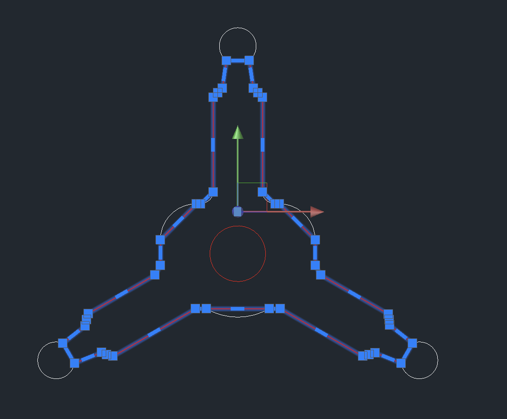

  Fig.5 Here a continuous polyline connecting all points.

  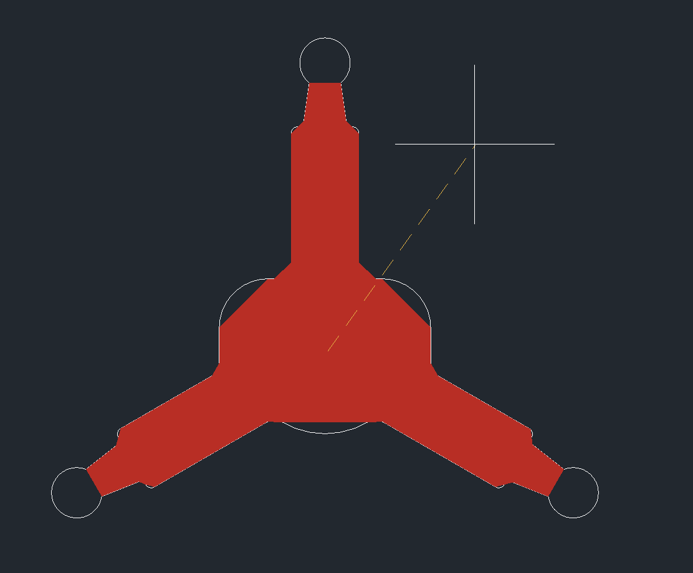

  Fig.6 Verify that the newly created polyline shape can extrude.

Do not apply the extrude. Make a copy of the rough polyline shape and paste it somewhere in your workspace as a backup.

### Convert straight segments to arcs

  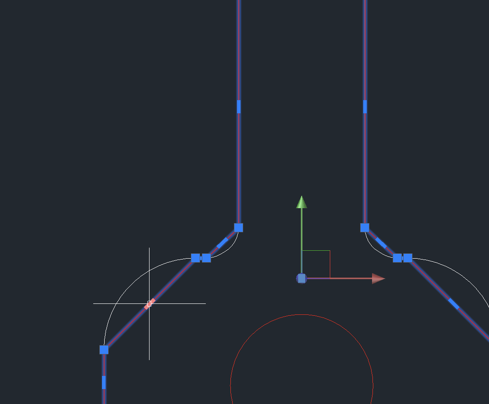

  Fig.7 Using the appropriate handles, transform straight segments into arcs and then match shape of arc to template as needed.

  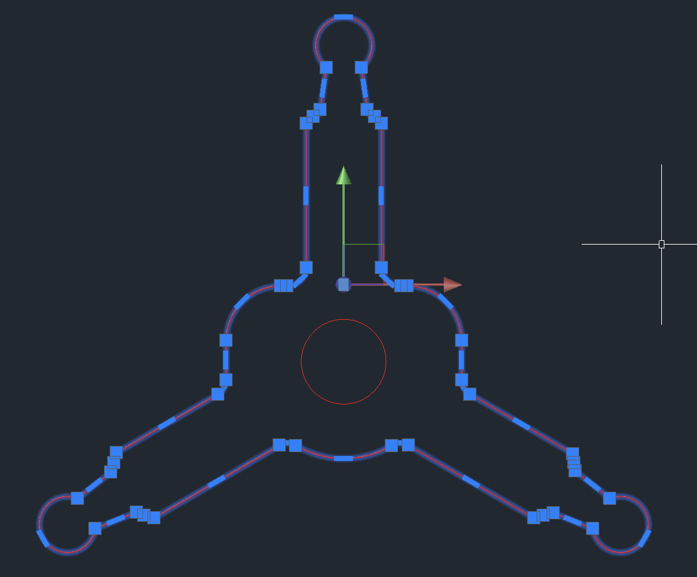

  Fig.8 Fully matching the template, with all required arcs.

  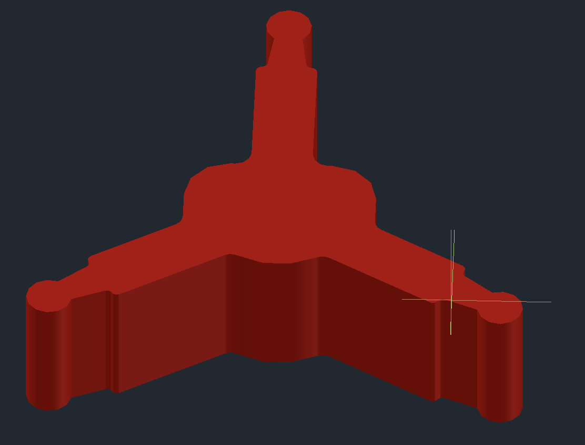

  Fig.9 Verify that the polyline shape can extrude.

### Use (boolean) *subtract* command

Make a safety copy of the new shape.

Assign the circle at the center back to the active layer. Both polyline shapes, star shape & center circle, are now on the active layer.

  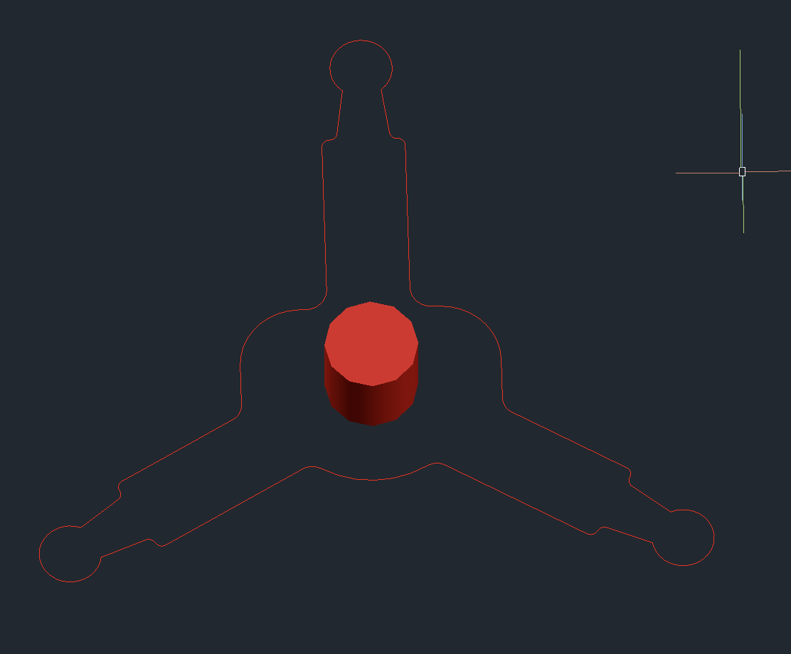

  Fig.10 Extrude the center circle first; set it to about 150% of the desired thickness of the star object, 50 in our case.

  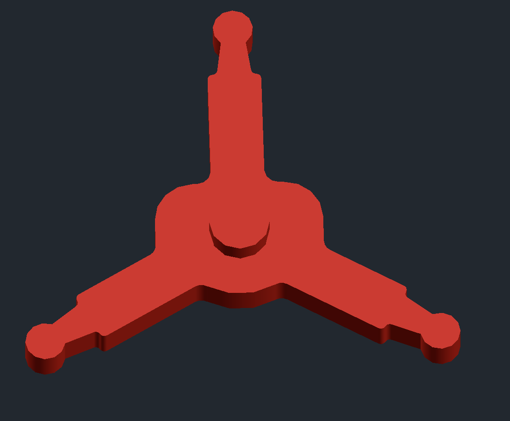

  Fig.11 Then extrude the star shape. We used 30.

In the physical world these star shapes are cut from 3mm thick acrylic. In our case the shape had to be scaled up by x10 to extrude successfully. To keep the right proportions thickness is multiplied x10.

  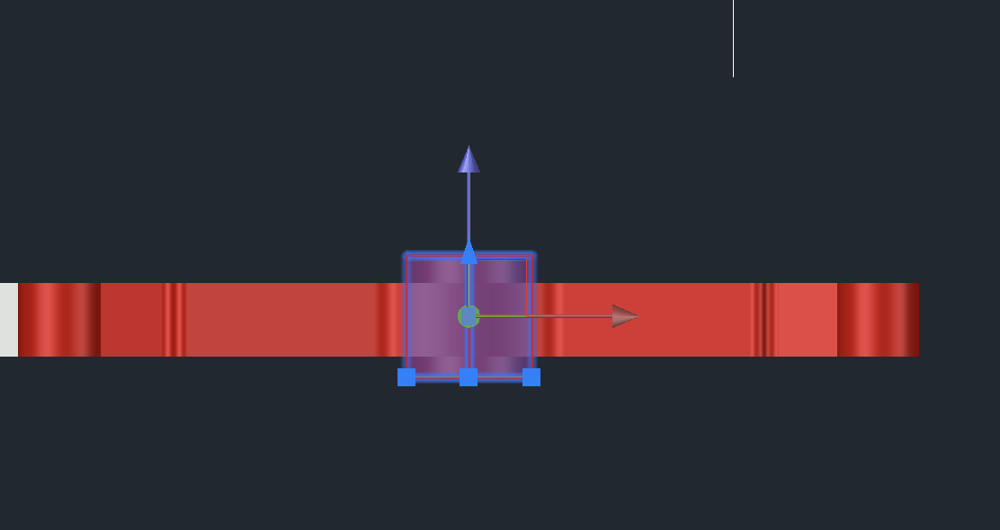

  Fig.12 Adjust vertical position of extruded center so that it extends a little on top and bottom. This will "cut" the hole from the star shape.

Use *subtract* command to make a boolean cut. This command expects selection of the object which is cut from first, confirm by pressing "return". Next select all shapes intended to cut material away and confirm with "return".

  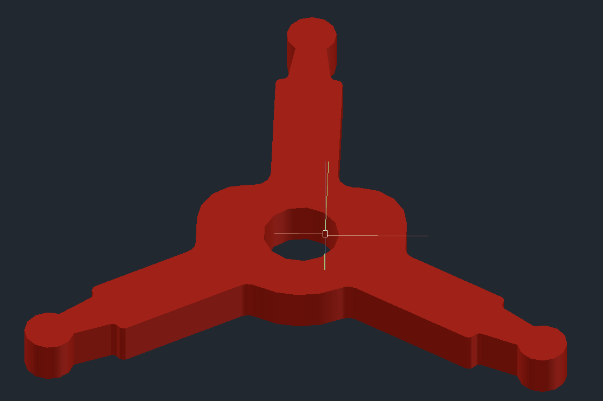

  Fig.13 Center has been punched out by the extruded circle.

  
If necessary scale the object back down by 0.1. 

## Troubleshooting

Sometimes even rebuilt shapes still refuse to extrude. If this happens, scale the shape x10 and try again. After successful extrusion, scale back down by x0.1. Another cause for extrusion failure could be a not-closed polyline. 

## Export STL of extruded object

To export the newly created 3d version of the 3-pronged star, select it. Use the "export" command. It will default to STL format and present a standard save dialog.

  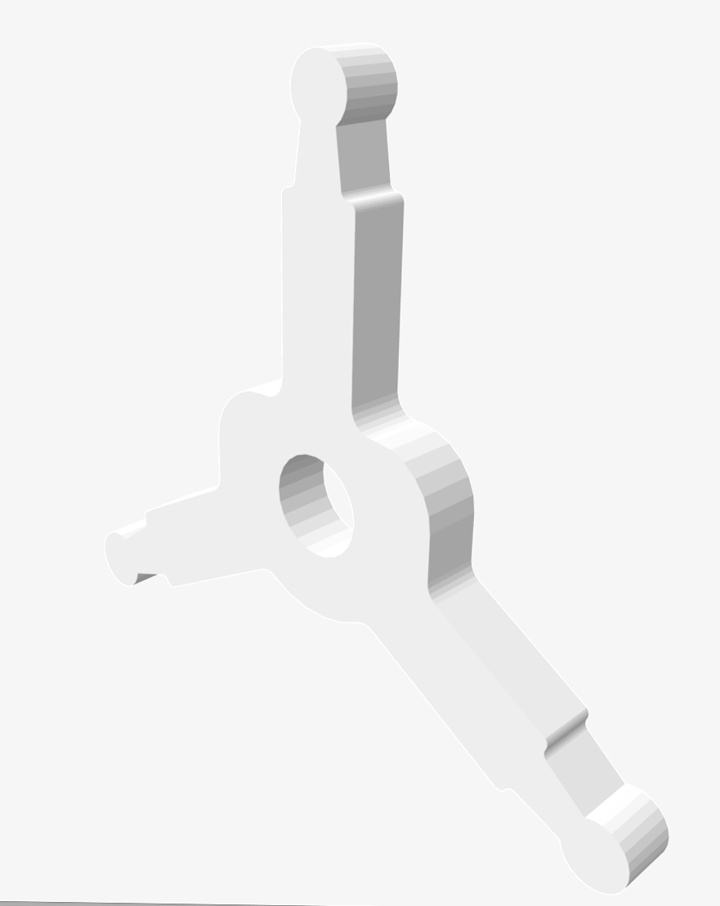

  Fig.14 The exported STL file.

