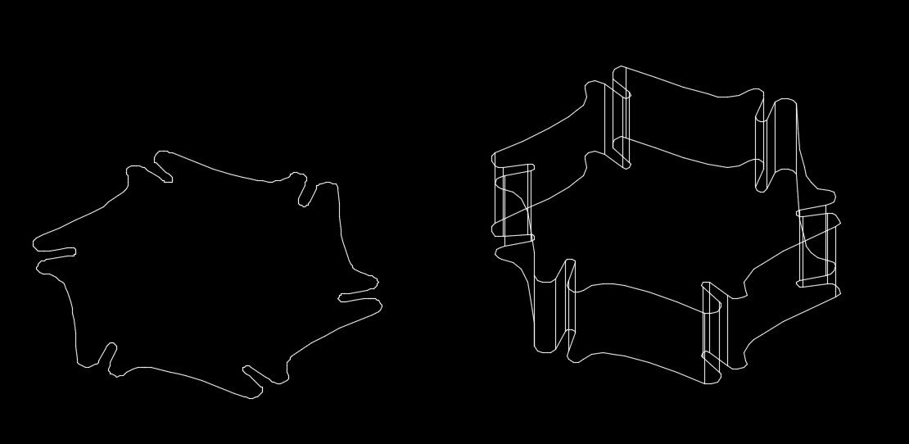

# Exporting STL files from AutoCad

## AutoCAD

[AutoCAD](https://www.autodesk.com/products/autocad/overview?term=1-YEAR&tab=subscription) is used to create precise 2D drawings. It is my go-to application to create 2D geometry for laser cutting. 

  Fig.1 Laser-cut acrylic parts (left), same set of parts in AutoCAD (right)

AutoCAD can also be utilized to produce complex and precise 3D drawings for architecture and engineering. For many of my own projects I need to create 3D assets from existing 2D drawings. One particular purpose are 3D visualizations of IoT projects, before any laser cut is made. 

  

  Fig.2 Partial assembly visualization (left), physical assembly (right)

In this case the 2D line drawing of a specific object in AutoCAD has to be transformed into a 3D object. This sounds like a relatively straight forward procedure; in a dedicated 3D application, such as Blender, one would use an *extrude* function to add "thickness" to a surface. Of course AutoCAD also has an *extrude* command and applied to a <strong>properly</strong> constructed 2D object it will yield useable results.

  

  Fig.3 2D object (left), successfully extruded into 3D (right)

Closed polylines are the only 2D primitives which can be extruded properly with top and bottom surfaces.
Primitives such as arcs, lines will extrude to connected walls, but even if closed will not produce top and bottom surface
splines are not extruded in AutoCAD. 2D objects that are composed of different types of 2D primitives will not extrude correctly.
It may help to scale up objects by a factor of 10 before extrusion in AutoCAD. They can be scaled back down in the target application.
Such mixed 2D objects are best "redrawn" using polylines.

The trick is that the 2D source object must be composed of <strong>polylines</strong> (also called <strong>plines</strong>). 
