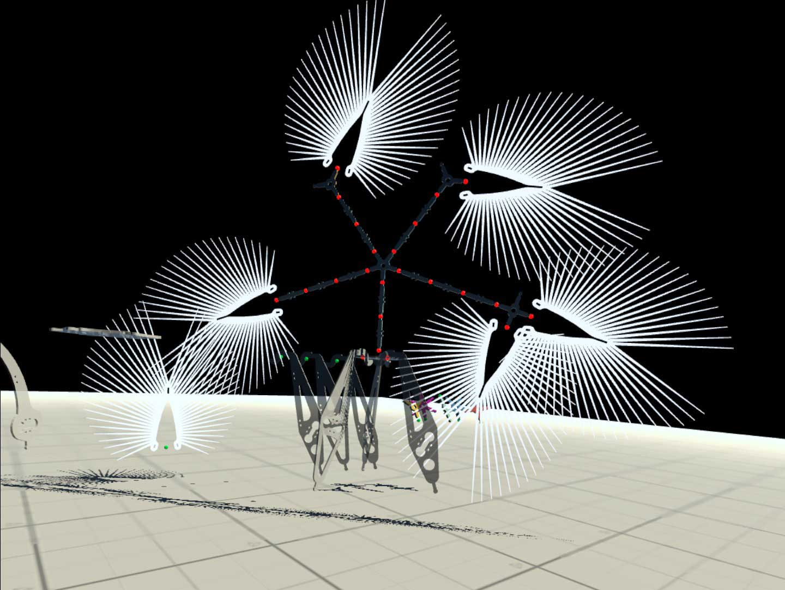
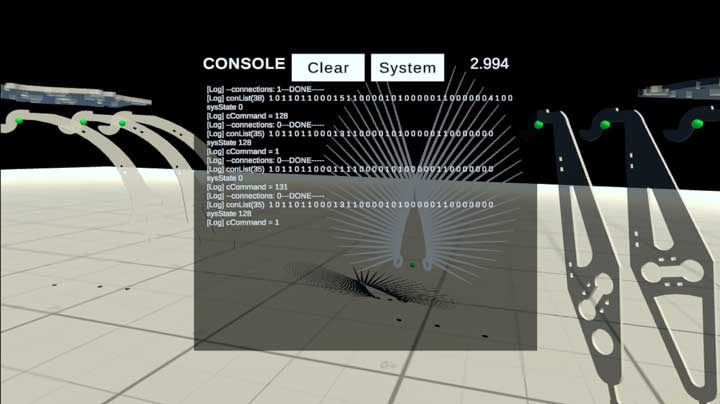
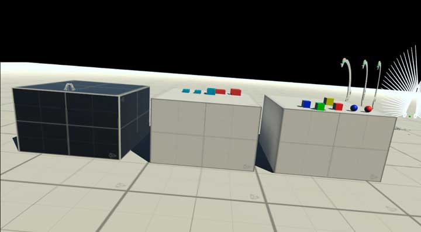
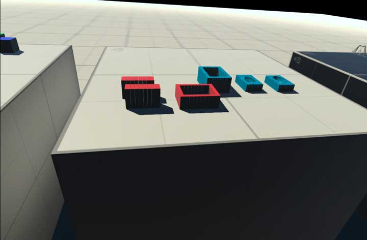
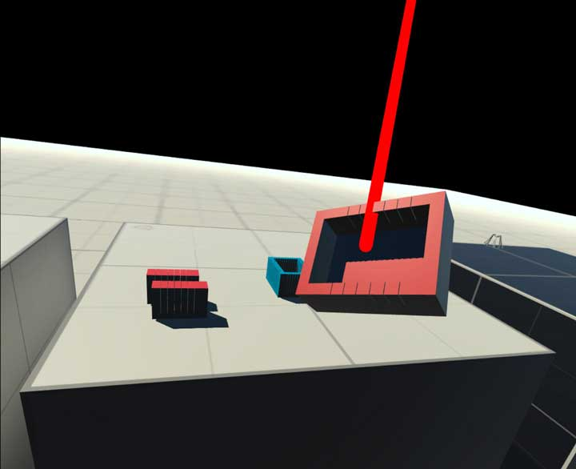
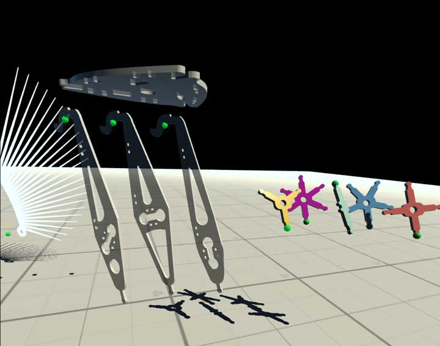
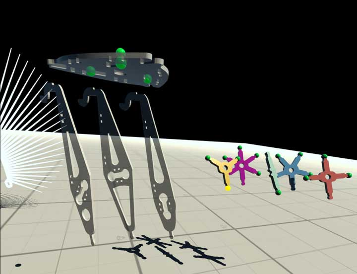
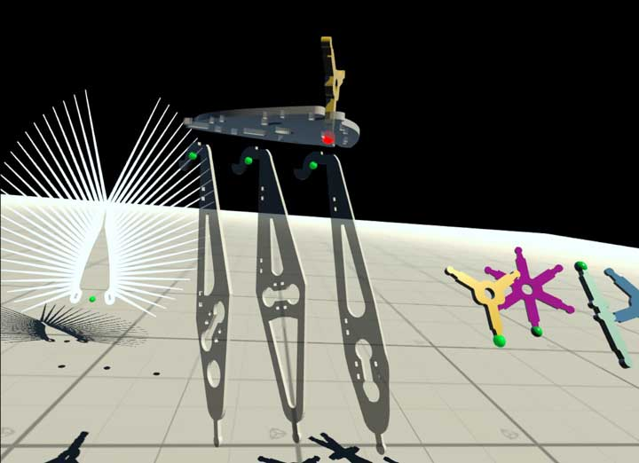
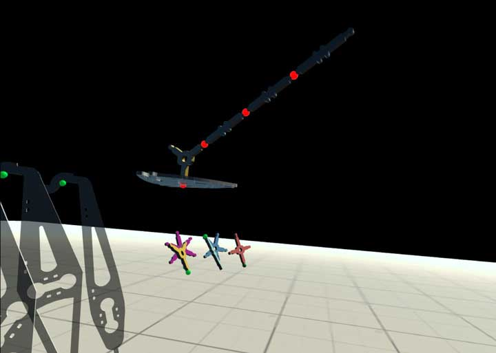

# 4025C_VR
(current version 0.1.10)

  

## Interaction instructions

After the app has launched, the console window will be visible as an overlay. This is used for diagnostics. To hide it press the menu button on the left controller.

### Left controller functions

Left controller actions interact with the console window, as does the left ray.

  

**Trigger Button** - "press" the virtual button the ray is pointed at (Clear, Sysyem/Nodes)

**Menu Button** - show/hide console

**Thumbstick** - forward/backward; adjust console window distance from viewer

### Right controller functions

Right controller actions interact with the VR room and the objects inside it. The thick blue ray from the right controller is used to teleport - instantly jump to the position the ray is pointed at - or interact with the small, colored control nodes on the objects. If the blue ray is pointed at a "solid" object, it will change its color to red.

**Grab Button** (teleport)  - if ray is pointed at the floor, a teleport is initiated, the ray stays blue

**Grab Button** (select) - select the spherical node object the ray is pointed at; results depend on previous actions (see below)

**Grab Button** (grab) - the three tables in the scene show various objects that can be picked up, dropped, thrown, etc. 

  

  

  

**Menu Button** - application control menu; quit, start video recording or take pictures

**Thumbstick** - left/right rotates the viewer in 45 degree increments to the left/right

### Specifics about the sphere node connectors

This version of the app has a larger assortment of "connectable" pieces (components from various IoT projects - all blown up to 10x their regular size).
These components have varying numbers of connector nodes on them. When the app launches, the user sees green nodes on some of the objects. Any of these nodes can be clicked. 

  

The clicked node will turn yellow to show that it is now waiting for the user to select a second node to connect it to. At that stage only eligible destination nodes are shown. Click any of them. 

  

The object is now moved so that both nodes are at the same location in the scene. This concludes a successful connection, the connected node turns red.

  

You will notice that rather than moving the original object to its destination, the app made a clone. Every successful connection clones the originator object. Infinite supply.

Connections between two objects have a red connector. Clicking on a red connector will dissolve the connection and delete all connected objects on this particular branch.

  

