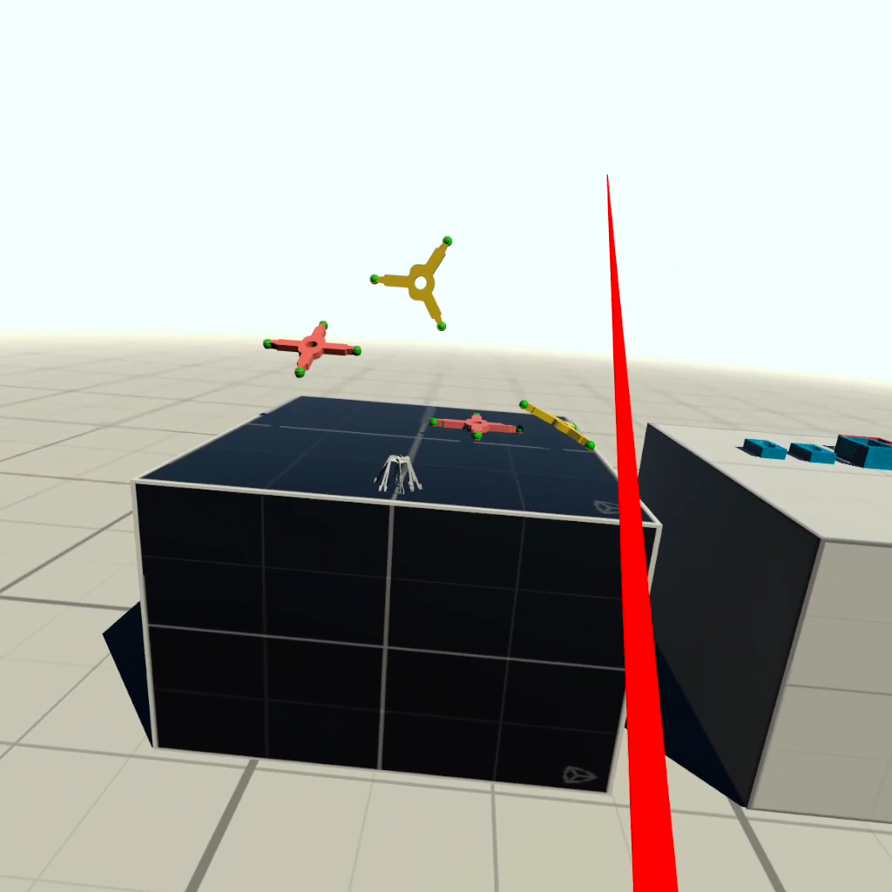
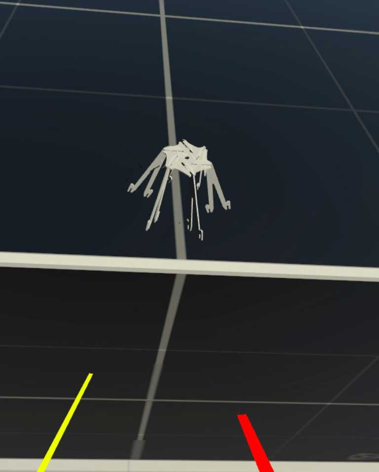
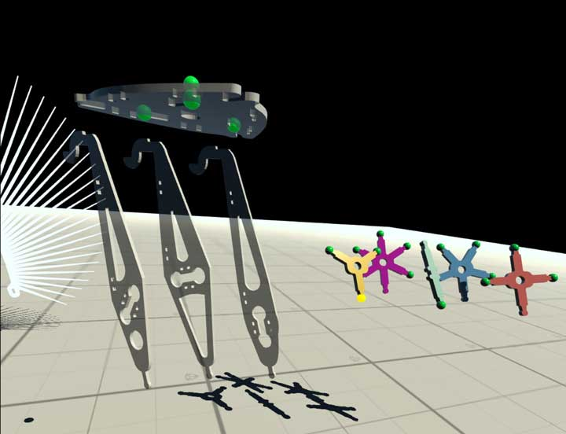

# 4025C_VR, V3 prospective features
 
## New Features Overview

- Main Area (MA), Assembly Area (AA)
- Teleport between areas using a "trigger" item
- Assemblies can be taken from AA to MA and vice versa
- Assemblies are "condensed" into code. In code form they are transported between areas, can be saved/loaded and re-assembled
- Save/load assemblies

## Main Area (MA)

  

  Fig.1 4025C-VR main work area

The Main Area (MA) is the default location for the VR user. After the application has launched the user is standing at one of the work tables. On the table are objects in the correct size relative to the user. The trigger object can be triggered and will teleport the user to the Assembly Area (AA).  

  

  Fig.2 Trigger object

## Assembly Area (AA)

  

  Fig.3 Assembly Area

After the user clicked the trigger object in MA, we are teleported to the AA. In AA we find a library of components, scaled to 10x their normal size. At regular size many of these components would be very hard to work with - especially the small spherical connector nodes (they are 5mm in diameter in MA and 5cm in AA, with a clickable envelope of 7mm and 7cm respectively). Here assembly of structures works like in V2 of the application.

### Specifics

In V2 there is a single connector list (conList) for the whole Unity scene. This list contains all connector nodes deployed in the scene at any given time. Operations add newly Instatiated nodes or remove deleted ones from the list as needed.

V3 will use the following mechanism:

As the user enters the AA, a ManifestNode is created. Metaphorically this node is like a stake in 3d space, where the new assembly is going to be built. Practically it is a GameObject, positioned in AA, serving as the anchor node for the new assembly. A script on that node contains the complete manifest for this assembly, i.e. conList, pList and connectors (I am sure this is subject to change).

The user will select one of the active connector nodes on one of the available components from a library. This component will connect to the ManifestNode in the usual manner. This action clones the clicked library object and puts the clone into the ManifestNode - its new parent. It will also update the manifest information and lists. From there the user selects available connector nodes on library components to connect their clones to the growing assembly. As this assembly process is going on with "physical" components (geometry objects), a virtual recipe could be built in parallel. 

The user will click on the ManifestNode to finalize/discard the assembly (request dialog needed).

Assembly is finalized by creating the recipe/code/data needed to recreate the assembly. This data is stored on the manifest. Ideally we want to be able to deploy the ManifestNode to a specified location in the scene and "inflate" it - or let the app build it.

As a default, clicking the ManifestNode in AA will teleport the user back to MA and place the finished assembly on the work table. This would require the following measures:
- compress the assembly instructions on the ManifestNode when user exits AA
- user arrives back in MA, ManifestNode is assembled into full assembly, at 1x scale
- now the assembly can only be handled as a single object; all connector nodes are invisible and inaccessible
- ManifestNode gets a RigidBody so it correctly interacts with objects in MA
- ManifestNode gets a BoxCollider, properly sized and aligned with geometry, so it properly sits on a surface
- BoxCollider is also required for any further interaction with the assembly (picking it up, or use as trigger to revisit AA)

A user should be able to trigger a visit to AA by clicking an assembly on the worktable. The assembly would move along to AA and be editable. 

Using ManifestNodes to store assemblies will allow the building of multiple structures.

## Save/Load

Compressing an assembly into a form of code/data would make saving/loading trivial on a regular computer. No geometry (mesh) is included in the data so the saved file would be fairly small.

Research is needed on how to save individual files on a VR headset. Worst case scenario is to only be able to save one "game state". This game state then includes all assemblies/structures the user added during a session. This game state could be saved upon (proper) exit of the application and loaded when it is launched again.  

