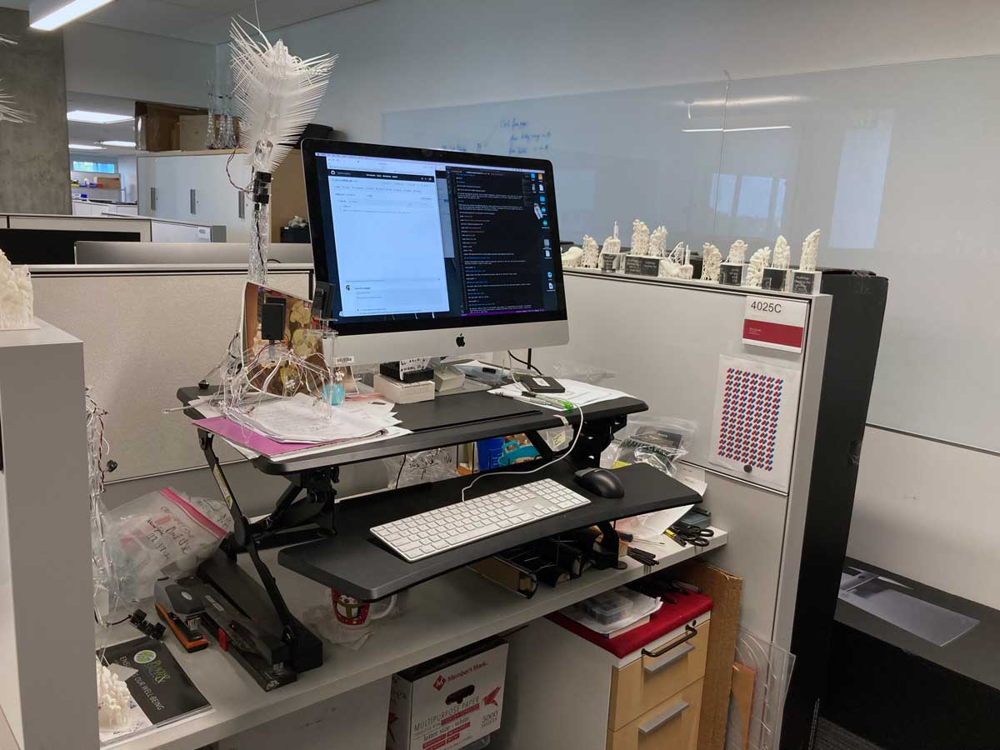

# 4025C_VR
 
4025C is the "address" of my workspace in the CNS suite on the 4th floor of IU's Luddy Hall. Most of the physical (hands-on) tasks I do at or around this desk. Some projects require 3D-printing or laser cutting, which are done at FabLab, the makerspace on the same floor.

  

  Fig.1 4025C physical workspace

Over the years we produced many IoT items, such as Moth, Dendrite, Fascinator, IoT Stars, Amaria, Millitome. In every project blueprints were developed, parts lists compiled, laser cut sheets drawn up and 3d-print files created. Many times physical items were laser cut from acrylic sheets - smaller quantities, just for testing. Often this iteration process went through several stages, producing acrylic waste. Equally 3D-printed items often needed refinements and went through repeated prints & misprints. 
