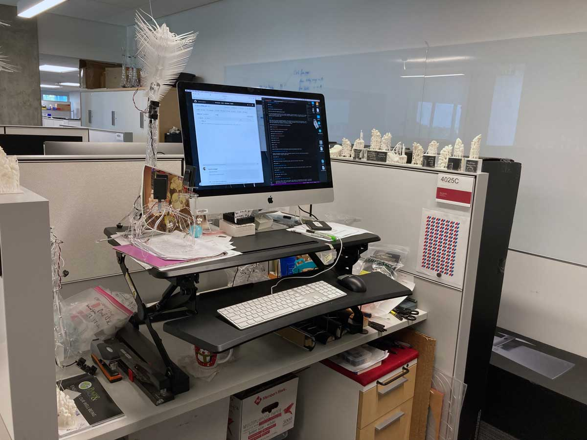
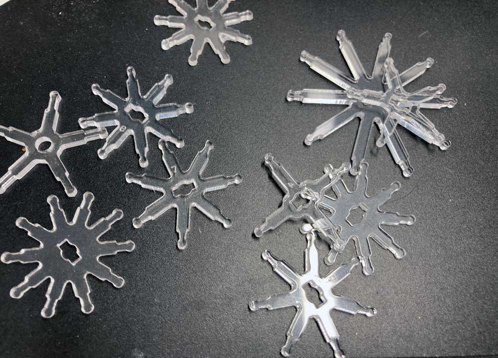
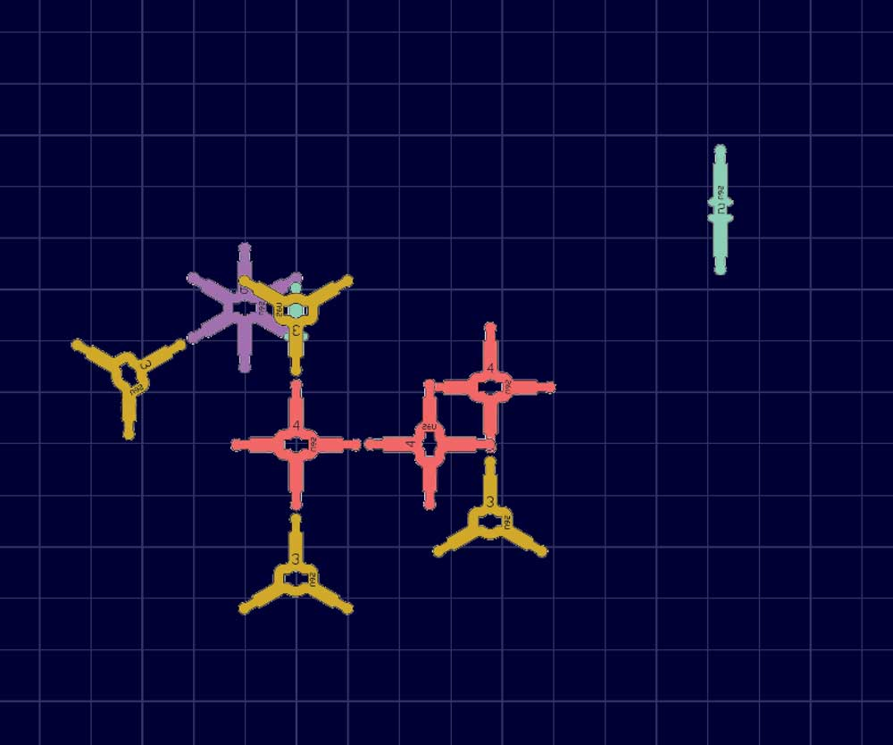

# 4025C_VR

## History
 
4025C is the "address" of my workspace in the CNS suite on the 4th floor of IU's Luddy Hall. Most of the physical (hands-on) tasks I do at or around this desk. Some projects require 3D-printing or laser cutting, which are done at FabLab, the makerspace on the same floor.

  

  Fig.1 4025C physical workspace

Over the years we produced many IoT items, such as Moth, Dendrite, Fascinator, IoT Stars, Amaria, Millitome. In every project blueprints are developed, parts lists compiled, laser cut sheets drawn up and 3d-print files created. In order to try how well fabricated parts fit together, a short run of components is 3d-printed or laser cut from acrylic sheets. Often first generation parts turn out to need refinements. Sometimes it takes multiple revisions. Each time material and production time is wasted (also, acrylic is not recyclable). 

A good example are IoT stars, which are sets of star shaped acrylic pieces to be assembled into geometric models using soft PVC tubing. Many of these were lasercut and never used. 

  

  Fig.2 A smattering of unused IoT Stars

In early 2020 I started to learn how to use a game engine called Unity and soon got the idea that there had to be a way to test our assets in a simulation before committing to producing physical items. In a virtual version of IoT Stars you would never run out of components and maybe be able to assemble structures impossible in the real world. Virtual IoT Stars turned into a small side project. It started in 2D and stayed there.

  

  Fig.3 Virtual IoT Stars - an experiment

In the Fall of 2021 I was invited to join the Red Pill/Blue Pill Unity programmers team at CNS. While the team has two large ongoing projects, I was encouraged to keep working on my "idea". I received an Oculus VR head set and started building "something", based on my IoT Stars. 

### Millitomes in VR

One project that starting at that time was the Millitome.

